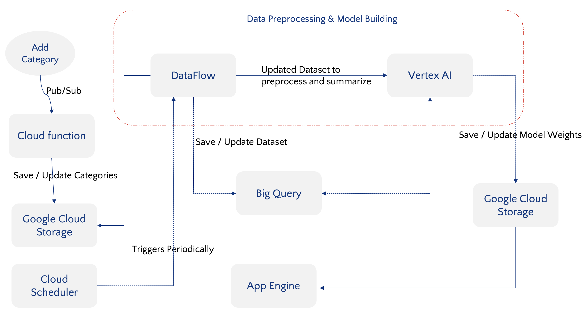
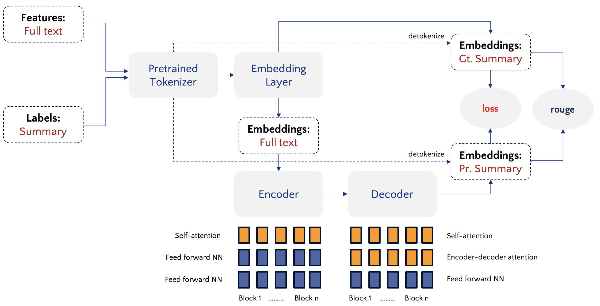
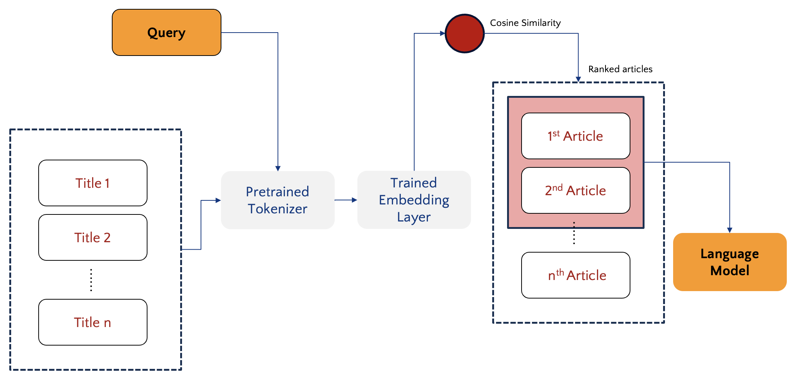

# From Query to Information: An Advanced Information Retrieval System Trained on Wikipedia

## Overview
We have developed an advanced information retrieval system designed to deliver accurate and comprehensive results using Wikipedia as the primary data source. The system leverages state-of-the-art machine learning models and natural language processing techniques to return precise information for various types of queries.

For more detailed information about the system's design and implementation, refer to our paper [here](report/An_Advanced_Information_Retrieval_System_Trained_on_Wikipedia.pdf).

## Features
- **Accurate Results:** Leveraging machine learning models trained on Wikipedia for accurate information retrieval.
- **Natural Language Understanding:** Ability to understand complex natural language queries.
- **Scalability:** Works well across a wide range of data sizes.

### Data Pipeline

A visualization of the data pipeline used in our system.

### Language Model

Diagram showing the architecture of the language model.

### Query Processing

Flowchart of the query processing workflow within the system.

## Demo Video
For a quick demonstration of how the system works, check out our demo video [here](demo/Demo.mov).
